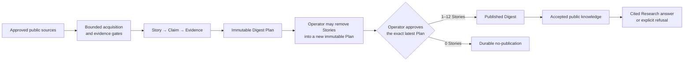

<div align="center">

# AI Ledger

**An evidence-grounded AI daily that turns approved public sources into reviewed Digests and cited Research.**

[English](README.md) · [简体中文](README.zh-CN.md)

[](https://github.com/Ev3rGan/ai-ledger/actions/workflows/ci.yml)

[](LICENSE)

**[Open the Public Demo](https://bench-tencent-hk.ai-ledger.cn/)**

</div>

AI Ledger is a compact public-intelligence service for following AI developments without losing the evidence behind them. It collects from a versioned source portfolio, drafts claim-level records, keeps publication under explicit operator control, and answers research questions only from accepted knowledge.

> [!IMPORTANT]
> Automation may collect, draft, rank, and compose. It cannot publish by itself. A public Digest appears only after an operator approves one exact, immutable Digest Plan.

## 🌱 Why AI Ledger

Fast AI news is plentiful; evidence you can inspect and publication decisions you can audit are not. AI Ledger makes those constraints part of the product rather than an afterthought.

| Need | AI Ledger's response |
| --- | --- |
| Trace a statement to its source | Each accepted Story carries Claims, exact Evidence Spans, and original-source links. |
| Prevent an Agent from silently publishing | The Editorial Agent proposes a versioned plan; one operator approval applies to that exact plan only. |
| Ask broader questions without invented support | Research retrieves accepted knowledge, validates material citations, and explicitly refuses unsupported work. |
| Operate a small service reproducibly | Locked environments, migrations, health checks, and local/production runbooks define the operating boundary. |

## ✨ What works today

| Capability | Product boundary |
| --- | --- |
| Controlled acquisition | Source profiles define allowed access, evidence strength, article-body or structured-data gates, cursors, and isolated failure behavior. |
| Traceable drafting | Provider-backed drafting produces Story, Claim, and Evidence records but cannot accept or publish them. |
| Human-gated editing | The protected Operator Console prepares or re-prepares one immutable Plan, removes any number of Stories one at a time, and approves only the exact latest version. |
| Durable completion | A non-empty approval publishes that exact composition and queues retrieval-index follow-up; a zero-Story approval records no-publication without creating a Digest or RSS item. |
| Hybrid retrieval | PostgreSQL full-text and Entity candidates combine with MiniLM vectors and a single mMARCO reranking stage, with an explicit model-free fallback. |
| Bounded Research | Lookup, comparison, timeline, and bounded multi-hop questions use isolated Evidence Sets, strict time semantics, and fail-closed citation checks. |
| PublicContent projection | Home, Digest, Archive, Story, Browse, RSS, and the Research entry page share one public-safe read boundary without operator controls, raw source bodies, or hidden reasoning. |

The M1–M5 product scopes and release records remain available in [#70](https://github.com/Ev3rGan/ai-ledger/issues/70), [#71](https://github.com/Ev3rGan/ai-ledger/issues/71), [#72](https://github.com/Ev3rGan/ai-ledger/issues/72), [#73](https://github.com/Ev3rGan/ai-ledger/issues/73), and [#74](https://github.com/Ev3rGan/ai-ledger/issues/74). Current build health is reported by [CI](https://github.com/Ev3rGan/ai-ledger/actions/workflows/ci.yml), not by a copied historical test count.

Direct Story accept/reject and direct Digest preview/publish commands are retired workflow surfaces. Operators use the protected Operator Console for the routine loop and the CLI only as its break-glass adapter. They review one immutable Plan, may derive successive versions by removing included Stories with recorded lineage and reasons, and approve only the exact latest version. Plans support 0–12 Stories; fewer than three Publishers is a visible non-blocking warning. Approving zero Stories records a durable no-publication outcome. See the [legacy-flow inventory](docs/legacy-flow-inventory.md) for the evidence and deletion gates.

## 🚀 Explore the product

The shortest path to a useful reader result is the deployed public product:

| Surface | Open it | What it provides |
| --- | --- | --- |
| Latest Digest | [Home](https://bench-tencent-hk.ai-ledger.cn/) | The latest reviewed edition, highlights, coverage, and recent editions |
| Published knowledge | [Browse](https://bench-tencent-hk.ai-ledger.cn/browse) | Stories filtered by keyword, publisher, Topic, or date |
| Cited answers | [Research](https://bench-tencent-hk.ai-ledger.cn/research) | Accepted-knowledge answers with clickable citations or an explicit refusal |
| Subscription | [RSS](https://bench-tencent-hk.ai-ledger.cn/rss.xml) | A machine-readable feed of published Digests |

Story pages expose the Claims, Evidence Spans, and source links behind a published item. Research does not browse the live Web or silently widen its scope.

## ⚡ Run a deterministic sample

> [!NOTE]
> Deterministic describes the input, not the storage boundary: this command persists its publication to the configured PostgreSQL database. It does not contact live sources or a Provider.

Make PostgreSQL available, apply the current migrations, and provide `AI_INTEL_DATABASE_URL` as described in the [local runbook](docs/mvp-local-runbook.md):

```powershell
git clone https://github.com/Ev3rGan/ai-ledger.git
cd ai-ledger
uv sync --locked --python 3.12 --extra ch3
# After completing the local database prerequisites:
uv run ai-intel-agent run --sample --output reports\daily.md
```

The command writes a sample Digest to `reports/daily.md`; generated reports are ignored by Git.

To run the complete local Web service, first follow the process-only database and Provider configuration in the [local runbook](docs/mvp-local-runbook.md), then run:

```powershell
uv run ai-intel-agent start-local
```

`start-local` owns PostgreSQL startup, migrations, the twice-daily scheduler, and the loopback Web service. Use `Ctrl+C` for its coordinated shutdown; keep credentials out of repository files and shell history.

## 🧭 How information becomes public knowledge



The production scheduler collects at 06:00 and 18:00 Asia/Shanghai and prepares traceable drafts. Scheduling never crosses the publication boundary.

## 🛡️ Trust and operating boundaries

| Area | Automation may | It may not |
| --- | --- | --- |
| Collection | Visit approved source surfaces, apply source policy, and preserve acquisition evidence | Widen the source scope silently or treat attention signals as factual proof |
| Publication | Draft Stories and propose an ordered Digest Plan | Accept a Story, change an approved plan, or publish without operator approval |
| Research | Retrieve accepted knowledge, orchestrate bounded subquestions, and stream progress | Use unpublished drafts, browse the live Web, expose hidden reasoning, or answer without material citation support |
| Operations | Execute documented, explicitly authorized commands | Store secrets in the repository or infer authority for live Provider, deployment, recovery, or destructive actions |

The public repository records interfaces and decisions—not secrets, private conversations, hidden reasoning, or sensitive production values. See [SECURITY.md](SECURITY.md) for reporting and handling guidance.

## 📚 Documentation

| Goal | Start here |
| --- | --- |
| Understand the product and code | [Learning Guide](docs/guide/README.md) |
| Navigate all maintained documentation | [Documentation index](docs/README.md) |
| Learn the domain and accepted decisions | [Domain model](CONTEXT.md) · [ADR index](docs/adr/README.md) |
| Run the service safely | [Local runbook](docs/mvp-local-runbook.md) · [Production runbook](docs/mvp-production-runbook.md) |
| Inspect evaluation evidence | [Research index](docs/research/README.md) |
| Trace superseded decisions | [Archive index](docs/archive/README.md) |

## 🧪 Development

The repository uses Python 3.12 and a locked `uv` environment. Before proposing a code change, run:

```powershell
uv run --extra dev pytest
uv run --extra dev ruff check .
uv run ai-intel-agent run --sample --output reports\daily.md
```

The sample gate requires the local PostgreSQL configuration documented in the runbook.

Read [CONTRIBUTING.md](CONTRIBUTING.md) and the [Code of Conduct](CODE_OF_CONDUCT.md) before contributing.

## License

Licensed under [Apache-2.0](LICENSE).
