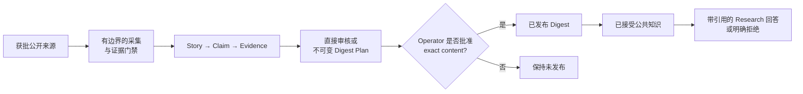

<div align="center">

# AI Ledger

**一份基于证据的 AI 日报，把获批公开来源转化为经审核的 Digest 与带引用的 Research。**

[English](README.md) · [简体中文](README.zh-CN.md)

[](https://github.com/Ev3rGan/ai-ledger/actions/workflows/ci.yml)

[](LICENSE)

**[打开 Public Demo](https://bench-tencent-hk.ai-ledger.cn/)**

</div>

AI Ledger 是一个紧凑的公共 AI 情报服务，让读者追踪行业进展时不会失去背后的证据。它从版本化来源组合中采集信息，生成 Claim 级可追溯记录，把发布权留给 operator，并且只依据已接受知识回答 Research 问题。

> [!IMPORTANT]
> 自动化可以采集、起草、排序和编排，但不能自行发布。只有 operator 直接接受 Story，或批准一份 exact、immutable Digest Plan 后，公开 Digest 才会出现。

## 🌱 为什么需要 AI Ledger

快速的 AI 资讯并不少见；可以检查的证据和可以审计的发布决定却很少。AI Ledger 把这些约束直接做成产品的一部分。

| 需求 | AI Ledger 的应对方式 |
| --- | --- |
| 从陈述追溯到来源 | 每条已接受 Story 都带有 Claim、精确 Evidence Span 与原始来源链接。 |
| 防止 Agent 静默发布 | Editorial Agent 只提出版本化计划；一次 operator 批准只对该 exact plan 生效。 |
| 在不虚构依据的前提下回答复杂问题 | Research 检索已接受知识、验证实质性引用，并明确拒绝证据不足的工作。 |
| 可复现地运行一个小型服务 | 锁定环境、迁移、健康检查和本地/生产 runbook 共同定义运行边界。 |

## ✨ 当前可用能力

| 能力 | 产品边界 |
| --- | --- |
| 受控采集 | Source Profile 定义允许访问的范围、证据强度、正文或结构化数据门禁、cursor 与故障隔离行为。 |
| 可追溯草稿 | Provider 辅助起草 Story、Claim 与 Evidence 记录，但不能接受或发布。 |
| 人类门禁编辑 | Operator 可以直接审核 Story，或批准一份完整且不可变的 Editorial Agent 计划。 |
| Hybrid retrieval | PostgreSQL FTS 与 Entity candidates 同 MiniLM 向量融合，再经过唯一的 mMARCO reranking stage；模型不可用时显式回退。 |
| 有边界的 Research | Lookup、comparison、timeline 与 bounded multi-hop 使用相互隔离的 Evidence Set、严格时间语义和 fail-closed 引用检查。 |
| 公共投影 | Home、Digest、Story、Browse、RSS 与 Research 只暴露已发布知识，不暴露 operator 控件或 hidden reasoning。 |

M1–M5 的产品范围与发布记录保留在 [#70](https://github.com/Ev3rGan/ai-ledger/issues/70)、[#71](https://github.com/Ev3rGan/ai-ledger/issues/71)、[#72](https://github.com/Ev3rGan/ai-ledger/issues/72)、[#73](https://github.com/Ev3rGan/ai-ledger/issues/73) 与 [#74](https://github.com/Ev3rGan/ai-ledger/issues/74) 中。当前构建健康度以 [CI](https://github.com/Ev3rGan/ai-ledger/actions/workflows/ci.yml) 为准，不在 README 中复制历史测试数字。

## 🚀 体验产品

获得第一个有效结果的最短路径，是直接使用已经部署的只读产品：

| 页面 | 打开 | 提供什么 |
| --- | --- | --- |
| 最新 Digest | [Home](https://bench-tencent-hk.ai-ledger.cn/) | 最新经审核版本、重点、来源覆盖与近期版本 |
| 已发布知识 | [Browse](https://bench-tencent-hk.ai-ledger.cn/browse) | 按关键词、publisher、Topic 或日期筛选 Story |
| 带引用回答 | [Research](https://bench-tencent-hk.ai-ledger.cn/research) | 只基于已接受知识的回答与可点击引用，或明确拒答 |
| 订阅 | [RSS](https://bench-tencent-hk.ai-ledger.cn/rss.xml) | 已发布 Digest 的机器可读 Feed |

Story 页面展示已发布内容背后的 Claim、Evidence Span 与来源链接。Research 不会实时浏览公网，也不会静默扩大问题范围。

## ⚡ 运行确定性样例

> [!NOTE]
> “确定性”描述的是输入，而不是存储边界：该命令会把发布结果持久化到已配置的 PostgreSQL，但不会访问真实来源或调用 Provider。

先按照[本地 runbook](docs/mvp-local-runbook.md)准备 PostgreSQL、应用当前迁移并提供 `AI_INTEL_DATABASE_URL`：

```powershell
git clone https://github.com/Ev3rGan/ai-ledger.git
cd ai-ledger
uv sync --locked --python 3.12 --extra ch3
# 完成本地数据库前置条件后：
uv run ai-intel-agent run --sample --output reports\daily.md
```

命令会把样例 Digest 写入 `reports/daily.md`；生成的报告已被 Git 忽略。

若要运行完整的本地 Web 服务，请先根据[本地 runbook](docs/mvp-local-runbook.md)完成仅属于进程的数据库与 Provider 配置，然后运行：

```powershell
uv run ai-intel-agent start-local
```

`start-local` 负责 PostgreSQL 启动、迁移、每日两次的 scheduler 和 loopback Web 服务。使用 `Ctrl+C` 协调停止；不要把凭据写进仓库文件或 shell 历史。

## 🧭 信息如何成为公共知识



生产 scheduler 在 Asia/Shanghai 每日 06:00 与 18:00 采集并准备可追溯草稿。定时运行不会越过发布边界。

## 🛡️ 信任与运行边界

| 区域 | 自动化可以 | 自动化不可以 |
| --- | --- | --- |
| 采集 | 访问获批来源页面、执行来源策略并保存采集证据 | 静默扩大来源范围，或把关注度信号当作事实依据 |
| 发布 | 起草 Story，提出有序 Digest Plan | 接受 Story、修改已批准计划，或绕过 operator 批准发布 |
| Research | 检索已接受知识、编排有边界子问题并输出进度 | 使用未发布草稿、实时浏览公网、暴露 hidden reasoning，或在实质性引用不足时回答 |
| 运维 | 执行已记录且明确授权的命令 | 把秘密写进仓库，或自行推断真实 Provider、部署、恢复和破坏性操作的权限 |

公开仓库记录接口与决策，不记录密钥、私密对话、hidden reasoning 或生产敏感值。安全报告与处理方式见 [SECURITY.md](SECURITY.md)。

## 📚 文档

| 目标 | 从这里开始 |
| --- | --- |
| 理解产品与代码 | [Learning Guide](docs/guide/README.md) |
| 浏览全部维护中的文档 | [文档总索引](docs/README.md) |
| 了解领域与已接受决策 | [领域模型](CONTEXT.md) · [ADR 索引](docs/adr/README.md) |
| 安全运行服务 | [本地 runbook](docs/mvp-local-runbook.md) · [生产 runbook](docs/mvp-production-runbook.md) |
| 检查评测证据 | [Research 索引](docs/research/README.md) |
| 追溯已被取代的决定 | [Archive 索引](docs/archive/README.md) |

## 🧪 开发

仓库使用 Python 3.12 与锁定的 `uv` 环境。提出代码变更前运行：

```powershell
uv run --extra dev pytest
uv run --extra dev ruff check .
uv run ai-intel-agent run --sample --output reports\daily.md
```

sample 门禁需要 runbook 所记录的本地 PostgreSQL 配置。

贡献前请阅读 [CONTRIBUTING.md](CONTRIBUTING.md) 与 [Code of Conduct](CODE_OF_CONDUCT.md)。

## License

采用 [Apache-2.0](LICENSE) 许可证。
